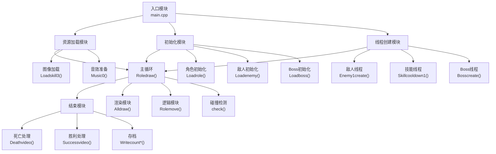

# 坤坤的奇妙冒险 - C语言+EasyX 游戏项目全解析
> 以代码致敬鬼畜文化，用技术还原趣味体验——这是一款围绕“坤坤”IP打造的横版战斗闯关游戏，也是我大一上C程序设计课程的期末实践成果。项目累计近3000行代码，覆盖图形渲染、多线程并发、音效控制、存档系统等核心技术，完整实现了“从菜单到战斗再到结算”的游戏闭环。

  


## 🌟 项目背景与设计初衷
作为一名刚接触C语言的大一学生，我希望通过一个“有趣且有挑战”的项目巩固知识点——既要有图形界面的直观交互，也要有复杂逻辑的代码实现。最终选择“坤坤”这一高辨识度的鬼畜IP，原因有二：
1. **素材丰富性**：角色、音效（如“鸡”“你干嘛哎哟”“厉不厉害你坤哥”）有大量现成资源，降低美术/音频制作成本；
2. **玩法适配性**：“篮球”“鸡蛋”等元素天然适合设计成攻击道具，Boss“马保国”的“接化发”“耗子尾汁”可转化为特色技能，增强游戏趣味性。

项目核心目标：用纯C语言+EasyX图形库，实现一款“能玩、好玩、有记忆点”的小型横版闯关游戏，同时兼顾代码的模块化与可扩展性。


## 🛠️ 技术栈与环境配置
### 1. 核心技术栈明细
| 技术类别       | 具体工具/库                          | 版本要求       | 核心作用                                                                 |
|----------------|--------------------------------------|----------------|--------------------------------------------------------------------------|
| 编程语言       | C语言                                | C99标准        | 实现所有游戏逻辑，包括角色移动、碰撞检测、线程控制等                       |
| 图形渲染       | EasyX 图形库（graphics.h）           | 2023以上       | 创建1000×650游戏窗口、双缓冲绘图、图像贴图层叠（SRCAND/SRCPAINT混合模式） |
| 音效控制       | Windows API（mmsystem.h）            | 随系统         | 播放背景音乐（MP3循环）、瞬时音效（WAV异步播放），控制音量（0-1000）      |
| 多线程         | Windows 线程API（process.h）          | 随系统         | 并发处理敌人创建、技能冷却、特效播放，避免主线程阻塞导致卡顿             |
| 开发工具       | Visual Studio 2022                   | 2022及以上     | 代码编辑、编译链接（需配置EasyX库路径）、调试（线程断点调试）             |
| 资源格式       | 图像（PNG）、音效（MP3/WAV）、文本（TXT） | 无特殊要求     | 存储角色帧动画、背景音乐、成就进度（如“鸡蛋攻击次数”“篮球发射次数”）     |
| 依赖库         | winmm.lib（链接器依赖）              | 随系统         | 支持mmsystem.h的音效函数调用                                             |

### 2. 环境搭建 step-by-step
#### （1）EasyX 库安装
1. 访问 [EasyX 官网](https://easyx.cn/) 下载最新版安装包；
2. 打开VS2022，运行安装包，选择“对应VS版本”完成集成；
3. 新建“空项目”，在源文件中添加`.c`/.`cpp`文件，包含头文件`<easyx.h>`或`<graphics.h>`即可使用。

#### （2）资源目录配置
游戏运行前需在项目根目录创建以下文件夹，否则会触发“资源加载失败”错误（代码中资源路径为相对路径）：
```
项目根目录/
├─ image/          # 图像资源（角色、背景、技能特效等）
│  ├─ role.png      # 玩家角色图像（4方向帧动画，384×576像素）
│  ├─ 坤.png        # 敌人1（坤）图像（4方向，400×400像素）
│  ├─ 马保国.png    # Boss图像（4方向，384×576像素）
│  ├─ 鸡蛋.png      # 敌人1攻击特效（30×30像素）
│  └─ ...（其他图像如恢复.png、玩家血量.png等）
├─ music/          # 音效资源
│  ├─ 剑仙鸡侠传.mp3 # 初始界面背景音乐
│  ├─ 接化发.mp3    # Boss战背景音乐
│  ├─ 鸡.wav        # 玩家普攻（篮球）音效
│  └─ ...（其他音效如死亡、胜利音效）
├─ 封面/           # 初始界面动态图像（1-19.png，1000×650像素）
├─ 大招/           # 玩家三技能帧动画（1-108.png，650×650像素）
├─ BOSS大招/       # Boss大招帧动画（1-50.png，1000×650像素）
├─ 死亡/           # 玩家死亡动画（1-53.png，1000×650像素）
├─ 胜利/           # 玩家胜利动画（1-38.png，1000×650像素）
└─ 鸡蛋.txt等8个TXT文件 # 成就进度存储（初始值可设为0）
```

#### （3）编译配置
1. 打开VS项目属性 → 配置属性 → C/C++ → 常规 → 附加包含目录：确保EasyX头文件路径正确；
2. 链接器 → 输入 → 附加依赖项：添加`winmm.lib`（若未自动添加）；
3. 选择“Debug/Release”模式（建议Release模式，运行更流畅），点击“生成”即可编译。


## 🎮 核心功能与源码深度解析
### 1. 项目整体架构（基于实际代码拆分）
项目采用“模块化+分层设计”，核心模块与函数调用关系如下：


### 2. 关键数据结构（基于代码实际定义）
代码中通过结构体封装所有游戏对象的属性，确保数据管理清晰，以下为核心结构体定义：

#### （1）玩家角色结构体（Roles）
```c
struct Roles
{
    int x;              // 横向坐标（0-850，受背景边界限制）
    int y;              // 纵向坐标（0-500，避免超出窗口）
    int position;       // 朝向（0=下、1=左、2=右、3=上，关联帧动画方向）
    bool life;          // 存活状态（true=存活，false=死亡）
    int bloodmax;       // 血量上限（初始10）
    int bloodnow;       // 当前血量（归0则触发死亡）
    int shield;         // 护盾值（代码中预留，暂未实现）
    bool time1;         // 一技能（加速）冷却状态（true=可释放）
    bool time2;         // 二技能（篮球普攻）冷却状态
    bool time3;         // 三技能（全屏大招）冷却状态
    bool times;         // 一技能持续状态（true=加速中）
    int speed;          // 移动速度（初始1，一技能激活时变为4）
} role;  // 全局玩家对象
```

#### （2）敌人结构体（Enemy1/Enemy2）
```c
// 敌人1（坤，第一波敌人，共4个）
struct Enemy1
{
    int x;              // 横向坐标（初始=bkX+1000+100*i，随背景移动）
    int y;              // 纵向坐标（随机100-500，rand()%400+100）
    bool life;          // 存活状态（true=存活，死亡后坐标设为114514）
    bool time;          // 攻击冷却状态（true=可释放鸡蛋攻击）
    int bloodmax;       // 血量上限（10）
    int bloodnow;       // 当前血量（归0后掉落鸡肉道具）
    int speed;          // 移动速度（1）
    int position;       // 朝向（始终朝向玩家，关联攻击方向）
} enemy1[4];  // 4个敌人1对象数组

// 敌人2（猪，第二波敌人，共4个）
struct Enemy2
{
    int x;              // 横向坐标（初始=bkX+400*i）
    int y;              // 纵向坐标（随机100-500）
    bool life;          // 存活状态
    bool time;          // 攻击冷却状态（血量≥3放“忠橙”，<3放“恩芹”）
    int bloodmax;       // 血量上限（5，比敌人1更弱但攻击更强）
    int bloodnow;       // 当前血量（归0后掉落紫蛋道具）
    int speed;          // 移动速度（1）
    int position;       // 朝向（始终朝向玩家）
} enemy2[4];  // 4个敌人2对象数组
```

#### （3）Boss结构体（Boss）
```c
struct Boss
{
    int x;              // 横向坐标（初始1000，随背景移动）
    int y;              // 纵向坐标（初始300，居中位置）
    int position;       // 朝向（0=下、1=左、2=右、3=上，随玩家位置变化）
    bool life;          // 存活状态（true=存活，死亡后触发胜利动画）
    int bloodmax;       // 血量上限（50，为敌人1的5倍）
    int bloodnow;       // 当前血量（≤10时释放全屏大招）
    int bloodcure;      // 回血值（代码预留，暂未实现）
    bool time1;         // 一技能（大理石/耗子尾汁）冷却状态
    bool time2;         // 二技能（预留）
    bool time3;         // 三技能（预留）
    int speed;          // 移动速度（1，比敌人更慢但更灵活）
} boss;  // 全局Boss对象（马保国）
```

#### （4）其他核心结构体
```c
// 技能结构体（玩家/敌人/Boss技能通用）
struct Skill
{
    int x;              // 技能坐标
    int y;
    int position;       // 技能方向（与释放者朝向一致）
    bool existence;     // 技能存在状态（true=显示并检测碰撞）
} skill2, backskill2, enemy1skill1[4], enemy2skill1[4], bossskill;

// 掉落物结构体（鸡肉/紫蛋，共8个）
struct Things
{
    int x;              // 道具坐标（与敌人死亡位置一致）
    int y;
    bool existence;     // 存在状态（敌人死亡后设为true）
    bool get;           // 获取状态（玩家触碰后设为true）
} things[8];  // 0-3=鸡肉（敌人1掉落），4-7=紫蛋（敌人2掉落）
```

### 3. 核心功能源码解析（结合实际代码逻辑）
#### （1）双缓冲渲染：解决画面闪烁的关键
游戏中所有绘图操作均通过`BeginBatchDraw()`/`EndBatchDraw()`包裹，确保“先在缓冲区绘制完整画面，再一次性刷新到屏幕”，彻底避免闪烁。核心渲染函数`Alldraw()`实现如下：

```c
void Alldraw()
{
    // 1. 绘制背景（随bkX移动，实现大地图效果）
    putimage(bkX, 0, &img_bk);  // img_bk为2000×650像素的背景图
    
    // 2. 绘制掉落物（鸡肉/紫蛋，未被获取时显示）
    for (int i = 0; i < 8; i++)
    {
        if (things[i].existence == true && things[i].get == false)
        {
            // 用SRCAND/SRCPAINT混合模式实现透明贴图（避免白色背景）
            putimage(things[i].x, things[i].y, &img_things[(i / 4) * 2], SRCAND);
            putimage(things[i].x, things[i].y, &img_things[(i / 4) * 2 + 1], SRCPAINT);
        }
    }
    
    // 3. 绘制玩家技能特效（篮球普攻）
    if (skill2.existence == true)
    {
        putimage(skill2.x, skill2.y, &img_skillef[0], SRCAND);
        putimage(skill2.x, skill2.y, &img_skillef[1], SRCPAINT);
    }
    
    // 4. 绘制敌人1（坤）：仅第一波存活时显示
    for (int i = 0; i < 4; i++)
    {
        if (enemy1[i].life == true && alldeath[0] == false)
        {
            // 绘制角色帧动画（J为帧索引，0-3循环，对应4个方向）
            putimage(enemy1[i].x, enemy1[i].y, 100, 100, 
                     &img_enemy[0], 100 * J, 100 * enemy1[i].position, SRCAND);
            putimage(enemy1[i].x, enemy1[i].y, 100, 100, 
                     &img_enemy[1], 100 * J, 100 * enemy1[i].position, SRCPAINT);
            // 绘制敌人血量条（红色矩形，随血量减少缩短）
            setlinecolor(RED);
            setfillcolor(RED);
            fillrectangle(enemy1[i].x + 5*(10 - enemy1[i].bloodnow), enemy1[i].y - 10, 
                         enemy1[i].x + 100 - 5*(10 - enemy1[i].bloodnow), enemy1[i].y);
        }
    }
    
    // 5. 绘制敌人2（猪）：仅第二波存活时显示
    for (int i = 0; i < 4; i++)
    {
        if (enemy2[i].life == true && alldeath[0] == true && alldeath[1] == false)
        {
            putimage(enemy2[i].x, enemy2[i].y, 100, 100, 
                     &img_enemy[2], 100 * J, 100 * enemy2[i].position, SRCAND);
            putimage(enemy2[i].x, enemy2[i].y, 100, 100, 
                     &img_enemy[3], 100 * J, 100 * enemy2[i].position, SRCPAINT);
            // 敌人2血量条（血量上限5，故每格20像素）
            fillrectangle(enemy2[i].x + 10*(5 - enemy2[i].bloodnow), enemy2[i].y - 10, 
                         enemy2[i].x + 100 - 10*(5 - enemy2[i].bloodnow), enemy2[i].y);
        }
    }
    
    // 6. 绘制Boss（马保国）：仅第三波显示
    if (alldeath[0] == true && alldeath[1] == true)
    {
        putimage(boss.x, boss.y, img_rolewidth, img_rolehigh, 
                 &img_boss[0], img_rolewidth * J, img_rolehigh * boss.position, SRCAND);
        putimage(boss.x, boss.y, img_rolewidth, img_rolehigh, 
                 &img_boss[1], img_rolewidth * J, img_rolehigh * boss.position, SRCPAINT);
        // Boss血量条（血量上限50，每格约2像素）
        fillrectangle(boss.x - 2 + (50 - boss.bloodnow), boss.y - 10, 
                     boss.x + 2 + 96 - (50 - boss.bloodnow), boss.y);
    }
    
    // 7. 绘制玩家角色
    putimage(role.x, role.y, img_rolewidth, img_rolehigh, 
             &img_role[0], img_rolewidth * I, img_rolehigh * role.position, SRCAND);
    putimage(role.x, role.y, img_rolewidth, img_rolehigh, 
             &img_role[1], img_rolewidth * I, img_rolehigh * role.position, SRCPAINT);
    
    // 8. 绘制玩家血量条（顶部显示，每格32×36像素）
    for (int i = 0; i < role.bloodnow; i++)
    {
        putimage(32 * i, 0, &img_roleblood[0], SRCAND);
        putimage(32 * i, 0, &img_roleblood[1], SRCPAINT);
    }
}
```

#### （2）角色移动与背景联动：实现“大地图”效果
游戏背景为2000×650像素的长图，通过`bkX`变量控制背景横向移动，当玩家移动到屏幕中间（x=500）时，不再移动玩家，而是移动背景和所有敌人/Boss/道具，模拟“大地图”探索感。核心函数`BkMove()`实现如下：

```c
void BkMove()
{
    // 仅当玩家在屏幕中间（x=500）且背景未达边界时，移动背景
    if (((role.x == 500 && bkX > -1000 && bkX <= 0) || (role.x == 500 && bkX < 0 && bkX >= -1000)))
    {
        // 右移（D键/右键）：背景左移，所有对象同步左移
        if (GetAsyncKeyState('D') || GetAsyncKeyState(VK_RIGHT))
        {
            role.position = 2;  // 玩家朝向设为右
            bkX -= 10 * role.speed;  // 背景左移速度=玩家速度×10
            // 敌人1同步左移
            for (int i = 0; i < 4; i++) enemy1[i].x -= 10 * role.speed;
            // 敌人2同步左移
            for (int i = 0; i < 4; i++) enemy2[i].x -= 10 * role.speed;
            // Boss同步左移
            boss.x -= 10 * role.speed;
            // 未获取的道具同步左移
            for (int i = 0; i < 8; i++)
                if (things[i].existence == true && things[i].get == false)
                    things[i].x -= 10 * role.speed;
        }
        
        // 左移（A键/左键）：背景右移，所有对象同步右移
        if (GetAsyncKeyState('A') || GetAsyncKeyState(VK_LEFT))
        {
            role.position = 1;  // 玩家朝向设为左
            bkX += 10 * role.speed;
            for (int i = 0; i < 4; i++) enemy1[i].x += 10 * role.speed;
            for (int i = 0; i < 4; i++) enemy2[i].x += 10 * role.speed;
            boss.x += 10 * role.speed;
            for (int i = 0; i < 8; i++)
                if (things[i].existence == true && things[i].get == false)
                    things[i].x += 10 * role.speed;
        }
    }
    
    // 背景边界限制：避免背景超出屏幕（bkX范围-1000~0）
    if (bkX > 0 || (bkX == 0 && role.x > 500))
    {
        role.x = 500;  // 玩家回到中间
        bkX = 0;       // 背景左边界
    }
    if (bkX < -1000 || (bkX == -1000 && role.x < 500))
    {
        role.x = 500;  // 玩家回到中间
        bkX = -1000;   // 背景右边界
    }
}

// 玩家自身移动（W/S键控制纵向，或背景达边界时横向移动）
void Rolemove()
{
    // 右移：背景达左边界（bkX=0）或玩家未到中间（x<500）时，移动玩家
    if ((((role.x <= 500 && bkX == 0) || (role.x >= 500 && bkX == -1000)) && (GetAsyncKeyState('D') || GetAsyncKeyState(VK_RIGHT))) && role.x < 850)
    {
        role.position = 2;
        role.x += 10 * role.speed;
    }
    
    // 左移：背景达右边界（bkX=-1000）或玩家未到中间（x>500）时，移动玩家
    if ((((role.x >= 500 && bkX == -1000) || (role.x <= 500 && bkX == 0)) && (GetAsyncKeyState('A') || GetAsyncKeyState(VK_LEFT))) && role.x > 0)
    {
        role.position = 1;
        role.x -= 10 * role.speed;
    }
    
    // 上移（W键/上键）：纵向边界0~500
    if (GetAsyncKeyState('W') || GetAsyncKeyState(VK_UP) && role.y > 0)
    {
        role.position = 3;
        role.y -= 10 * role.speed;
    }
    
    // 下移（S键/下键）：纵向边界0~500
    if (GetAsyncKeyState('S') || GetAsyncKeyState(VK_DOWN) && role.y < 500)
    {
        role.position = 0;
        role.y += 10 * role.speed;
    }
}
```

#### （3）玩家技能系统：三技能设计与实现
游戏为玩家设计3个技能，通过“O（加速）、J（普攻）、K（大招）”按键释放，每个技能均有冷却时间和特效，核心函数`Roleskill()`与`Skillkeep2()`实现如下：

##### ① 技能总控（Roleskill()）
```c
void Roleskill()
{
    // 一技能：加速（O键，无伤害，提升移速）
    if (GetAsyncKeyState('O') && role.time1 == true)
    {
        role.speed = 4;                  // 移速从1提升到4
        Music4();                       // 播放“厉不厉害”音效
        role.time1 = false;              // 进入冷却
        // 创建冷却线程：2秒加速持续+3秒冷却，共5秒后可再次释放
        _beginthreadex(NULL, 0, (unsigned int(__stdcall*)(void*))Skillcooldown1, NULL, 0, NULL);
    }
    
    // 二技能：篮球普攻（J键，主要伤害手段）
    if (GetAsyncKeyState('J') && role.time2 == true)
    {
        role.time2 = false;              // 进入冷却
        count8++;                       // 累计篮球发射次数（成就“灌篮高手”）
        Music1();                       // 播放“鸡.wav”音效
        // 创建技能持续线程：控制篮球轨迹与碰撞
        _beginthreadex(NULL, 0, (unsigned int(__stdcall*)(void*))Skillkeep2, NULL, 0, NULL);
        // 创建冷却线程：技能结束后自动解除冷却
        _beginthreadex(NULL, 0, (unsigned int(__stdcall*)(void*))Skillcooldown2, NULL, 0, NULL);
    }
    
    // 三技能：全屏大招（K键，秒杀小怪，Boss减10血）
    if (GetAsyncKeyState('K') && role.time3 == true)
    {
        role.time3 = false;              // 进入冷却（20秒）
        screen = true;                   // 锁定屏幕，禁止其他绘制
        Music2();                       // 播放“三技能.wav”音效
        Skill3video();                  // 播放108帧大招动画
        
        // 根据当前波次（situation）判断伤害目标
        if (situation == 1)  // 第一波：敌人1
        {
            for (int i = 0; i < 4; i++)
                if (enemy1[i].life == true)
                    enemy1[i].bloodnow -= 10;  // 秒杀（敌人1血量10）
            Enemy1hp();  // 检查敌人1是否死亡
        }
        else if (situation == 2)  // 第二波：敌人2
        {
            for (int i = 0; i < 4; i++)
                if (enemy2[i].life == true)
                    enemy2[i].bloodnow -= 10;  // 秒杀（敌人2血量5）
            Enemy2hp();  // 检查敌人2是否死亡
        }
        else if (situation == 3)  // 第三波：Boss
        {
            boss.bloodnow -= 10;  // Boss减10血（总血量50）
            Bosshp();             // 检查Boss是否死亡，触发大招
        }
        
        // 创建冷却线程：20秒后可再次释放
        _beginthreadex(NULL, 0, (unsigned int(__stdcall*)(void*))Skillcooldown3, NULL, 0, NULL);
    }
}
```

##### ② 二技能（篮球）详细逻辑（Skillkeep2()）
```c
void Skillkeep2(void* pParam)
{
    // 初始化随机种子（结合线程ID，避免多线程随机重复）
    srand((unsigned int)time(NULL) + (unsigned int)GetCurrentThreadId());
    skill2.existence = true;          // 技能存在状态设为true
    int jx = role.x, jy = role.y;     // 记录技能释放时的玩家位置（避免随玩家移动）
    
    // 向下释放（玩家朝向0）
    if (role.position == 0)
    {
        // 技能移动轨迹：向下移动50步，每步10像素
        for (int i = 0; i < 50; i++)
        {
            if (screen == true) goto F;  // 全屏技能时终止
            
            // 计算技能坐标（玩家下方，居中）
            skill2.x = jx + 23;          // 玩家宽度96，23=（96-50）/2，技能居中
            skill2.y = 144 + jy + 10 * i;// 144=玩家高度，技能从玩家下方开始移动
            
            // 双缓冲绘制技能
            BeginBatchDraw();
            Alldraw();
            // 控制技能移动速度（每步20毫秒）
            clock_t start_time = clock();
            while ((clock() - start_time) < 20 * CLOCKS_PER_SEC / 1000){}
            EndBatchDraw();
            
            // 检测技能是否命中敌人1
            for (int i = 0; i < 4; i++)
            {
                if (check(skill2.x, skill2.y, 50, 50, enemy1[i].x, enemy1[i].y, 100, 100) == true)
                {
                    enemy1[i].bloodnow -= 4;  // 敌人1减4血
                    goto T1;
                }
            }
            
            // 检测技能是否命中敌人2（仅第二波）
            for (int i = 0; i < 4; i++)
            {
                if (check(skill2.x, skill2.y, 50, 50, enemy2[i].x, enemy2[i].y, 100, 100) == true && situation == 2)
                {
                    enemy2[i].bloodnow -= 4;  // 敌人2减4血（血量5，2次可击杀）
                    goto T1;
                }
            }
            
            // 检测技能是否命中Boss（仅第三波，50%概率命中，50%反弹）
            if (check(skill2.x, skill2.y, 50, 50, boss.x, boss.y, 96, 144) == true && situation == 3)
            {
                if (rand() % 2 == 1)  // 50%命中
                {
                    boss.bloodnow -= 4;      // Boss减4血
                    Music9();               // 播放“我去.wav”受击音效
                    goto T1;
                }
                else  // 50%反弹（Boss“接化发”效果）
                {
                    // 记录反弹技能的初始位置与方向
                    S->x = skill2.x;
                    S->y = skill2.y;
                    S->position = 3;  // 反弹方向向上（与释放方向相反）
                    // 创建反弹技能线程
                    _beginthreadex(NULL, 0, (unsigned int(__stdcall*)(void*))Skillback, S, 0, NULL);
                    goto F;
                }
            }
        }
    T1:
        // 检查敌人/Boss是否死亡
        Enemy1hp();
        Enemy2hp();
        Bosshp();
        Rolehp;  // 冗余调用，确保玩家血量显示正确
    }
    
    // 向左释放（玩家朝向1）、向右释放（朝向2）、向上释放（朝向3）逻辑类似
    // 仅坐标计算不同，此处省略...
    
F:
    skill2.existence = false;  // 技能结束，设为不存在
    _endthreadex(0);           // 结束线程
}
```

#### （4）敌人AI与Boss特色技能
敌人与Boss具备“自动追踪+定向攻击”的AI逻辑，Boss还会在残血时释放全屏大招，核心实现如下：

##### ① 敌人1（坤）攻击AI（Enemy1keep1()）
```c
void Enemy1keep1(void* pParam)
{
    while (1)
    {
        // 仅第一波（situation=1）且背景音乐初始化完成（g0=1）时激活
        if (situation == 1 && g0 == 1)
        {
            for (int i = 0; i < 4; i++)
            {
                // 敌人存活且攻击冷却结束
                if (enemy1[i].life == true && enemy1[i].time == true)
                {
                    enemy1[i].time = false;              // 进入冷却
                    enemy1skill1[i].existence = true;   // 激活鸡蛋攻击特效
                    int jx = enemy1[i].x, jy = enemy1[i].y;  // 记录攻击初始位置
                    
                    // 向下攻击（敌人朝向0）
                    if (enemy1[i].position == 0)
                    {
                        for (int j = 0; j < 50; j++)  // 鸡蛋移动轨迹
                        {
                            if (screen == true) goto F;  // 全屏技能时终止
                            
                            // 鸡蛋坐标（敌人下方居中）
                            enemy1skill1[i].x = jx + 35;  // 敌人宽度100，35=（100-30）/2
                            enemy1skill1[i].y = jy + 30 - 10 * j;  // 向上移动
                            
                            // 绘制鸡蛋特效
                            BeginBatchDraw();
                            Alldraw();
                            clock_t start_time = clock();
                            while ((clock() - start_time) < 20 * CLOCKS_PER_SEC / 1000){}
                            EndBatchDraw();
                            
                            // 检测是否命中玩家
                            if (check(enemy1skill1[i].x, enemy1skill1[i].y, 30, 30, role.x, role.y, 96, 144) == true)
                            {
                                count1++;               // 累计鸡蛋攻击次数（成就“鸡飞蛋打”）
                                role.bloodnow -= 1;     // 玩家减1血
                                goto T1;
                            }
                        }
                    T1:
                        Rolehp();  // 检查玩家是否死亡
                    }
                    
                    // 其他方向攻击逻辑类似，此处省略...
                    
                F:
                    enemy1skill1[i].existence = false;  // 攻击结束
                    // 等待全屏技能结束，避免卡顿
                    while (1)
                    {
                        if (screen == false) break;
                    }
                }
            }
            // 创建攻击冷却线程：所有敌人攻击结束后，5秒后可再次攻击
            _beginthreadex(NULL, 0, (unsigned int(__stdcall*)(void*))Enemy1cooldown1, NULL, 0, NULL);
        }
    }
    _endthreadex(0);
}
```

##### ② Boss残血大招（Bossbigskill()）
当Boss血量≤10时，会释放全屏大招，播放50帧动画并扣除玩家8血（几乎秒杀），实现如下：

```c
void Bossbigskill()
{
    // valid=1：确保大招仅释放一次
    if (boss.bloodnow <= 10 && valid == 1)
    {
        screen = true;           // 锁定屏幕，禁止其他绘制
        Musicb();                // 播放“鞭.wav”大招音效
        valid = 0;               // 禁用大招，避免重复释放
        
        // 播放Boss大招动画（50帧，每帧120毫秒）
        for (int i = 0; i < 50; i++)
        {
            BeginBatchDraw();
            putimage(0, 0, &img_bossskill[i]);  // 绘制当前帧动画
            EndBatchDraw();
            clock_t start_time = clock();
            while ((clock() - start_time) < 120 * CLOCKS_PER_SEC / 1000){}
        }
        
        screen = false;          // 解锁屏幕
        role.bloodnow -= 8;      // 玩家扣除8血（初始10血，仅剩2血）
        Rolehp();                // 检查玩家是否死亡
    }
}
```

#### （5）成就系统与存档：持久化记录游戏进度
游戏设计8项成就，通过8个文本文件记录进度（如`鸡蛋.txt`记录被鸡蛋攻击次数），每次游戏结束（死亡/胜利）自动保存，核心读写函数如下：

```c
// 读取鸡蛋攻击次数（count1）
void Readcount1() 
{
    errno_t err = fopen_s(&file1, FILENAME1, "r");  // FILENAME1="鸡蛋.txt"
    if (err != 0)  // 文件打开失败（如首次运行无文件）
    {
        perror("Error opening file");  // 打印错误信息
        exit(EXIT_FAILURE);            // 退出程序
    }
    fscanf_s(file1, "%d", &count1);   // 读取文件中的数字到count1
    fclose(file1);                    // 关闭文件
}

// 写入鸡蛋攻击次数
void Writecount1()
{
    errno_t err = fopen_s(&file1, FILENAME1, "w");  // 以写入模式打开
    if (err != 0)
    {
        perror("Error opening file");
        exit(EXIT_FAILURE);
    }
    fprintf_s(file1, "%d", count1);   // 将count1写入文件
    fclose(file1);
}

// 其他7项成就（忠橙、恩芹、紫蛋、鸡肉、大理石、耗子尾汁、篮球）的Read/Write函数类似
// 仅文件名（FILENAME2-FILENAME8）和变量（count2-count8）不同，此处省略...
```

成就展示在初始界面的“达成成就”选项中，通过`Initdraw()`函数绘制，示例如下：
```c
// 成就界面绘制（Initdraw()函数中）
if (m.uMsg == WM_LBUTTONDOWN && m.x >= 150 && m.x <= 294 && m.y >= 280 && m.y <= 320)
{
    putimage(0, 0, &img_honor);  // 绘制成就背景图
    
    // 成就名称数组
    char f[8][10];
    sprintf_s(f[0], "鸡飞蛋打:");    // count1≥200达成
    sprintf_s(f[1], "精忠报国:");    // count2≥100达成（忠橙攻击）
    sprintf_s(f[2], "恩重如山:");    // count3≥100达成（恩芹攻击）
    sprintf_s(f[3], "不死之躯:");    // count4≥50达成（吃紫蛋）
    sprintf_s(f[4], "酒池肉林:");    // count5≥50达成（吃鸡肉）
    sprintf_s(f[5], "无坚不摧:");    // count6≥150达成（大理石攻击）
    sprintf_s(f[6], "百毒不侵:");    // count7≥150达成（耗子尾汁攻击）
    sprintf_s(f[7], "灌篮高手:");    // count8≥300达成（发射篮球）
    
    // 成就进度字符串
    char buffer[8][50];
    for (int i = 0; i < 8; i++)
    {
        switch(i)
        {
            case 0:
                sprintf_s(buffer[0], count1>=200 ? "累计接受了%d/200个鸡蛋的攻击(已达成)" : "累计接受了%d/200个鸡蛋的攻击(未达成)", count1);
                break;
            case 1:
                sprintf_s(buffer[1], count2>=100 ? "累计接受了%d/100个忠橙的攻击(已达成)" : "累计接受了%d/100个忠橙的攻击(未达成)", count2);
                break;
            // 其他成就进度判断类似，此处省略...
        }
    }
    
    // 绘制成就名称（黄色，50号字）
    setcolor(YELLOW);
    settextstyle(50, 23, _T("幼圆"));
    for (int i = 0; i < 8; i++)
        outtextxy(100, 40 + i*71, f[i]);
    
    // 绘制成就进度（蓝色，30号字）
    setcolor(BLUE);
    settextstyle(30, 14, _T("幼圆"));
    for (int i = 0; i < 8; i++)
        outtextxy(330, 52 + i*71, buffer[i]);
    
    // 绘制“返回”按钮
    setcolor(WHITE);
    settextstyle(40, 18, _T("幼圆"));
    outtextxy(928, 0, _T("返回"));
    
    // 等待玩家点击返回
    while (1)
    {
        if (KEY_DOWN(VK_LBUTTON))
        {
            m = GetMouseMsg();
            if (m.uMsg == WM_LBUTTONDOWN && m.x >=928 && m.x <=1000 && m.y >=0 && m.y <=40)
                break;
        }
    }
}
```

#### （6）游戏主循环与结束逻辑（main.cpp）
```c
#include "initcode.h"
int main()
{
    // 1. 读取成就进度（从8个TXT文件）
    Readcount1();
    Readcount2();
    Readcount3();
    Readcount4();
    Readcount5();
    Readcount6();
    Readcount7();
    Readcount8();
    
    Sleep(1000);  // 等待文件读取完成
    srand((unsigned int)time(NULL));  // 初始化随机种子
    LoadImg();  // 加载所有图像资源
    initgraph(1000, 650, 1);  // 创建1000×650游戏窗口
    
    // 2. 初始化游戏数据
    Loaddata();  // 初始化角色、敌人、Boss、技能数据
    Music0();    // 播放初始界面背景音乐（剑仙鸡侠传.mp3）
    Initdraw();  // 显示初始界面（菜单交互）
    
    // 3. 进入游戏主场景
    putimage(0, 0, &img_bk);  // 绘制背景
    Music();     // 播放游戏背景音乐（bgm.mp3）
    
    // 4. 创建多线程（敌人、Boss、技能逻辑）
    _beginthreadex(NULL, 0, (unsigned int(__stdcall*)(void*))Enemy1create, NULL, 0, NULL);  // 敌人1创建
    _beginthreadex(NULL, 0, (unsigned int(__stdcall*)(void*))Enemy1keep1, NULL, 0, NULL);  // 敌人1攻击
    _beginthreadex(NULL, 0, (unsigned int(__stdcall*)(void*))Enemy2create, NULL, 0, NULL);  // 敌人2创建
    _beginthreadex(NULL, 0, (unsigned int(__stdcall*)(void*))Enemy2keep1, NULL, 0, NULL);  // 敌人2攻击
    _beginthreadex(NULL, 0, (unsigned int(__stdcall*)(void*))Bosscreate, NULL, 0, NULL);    // Boss创建
    _beginthreadex(NULL, 0, (unsigned int(__stdcall*)(void*))Bosskeep1, NULL, 0, NULL);    // Boss攻击
    
    // 5. 游戏主循环（持续绘制与逻辑更新）
    while (1)
    {
        Roledraw();  // 绘制玩家、处理移动/技能/道具拾取
        if (Rolelifejudge())  // 检查玩家是否死亡
            goto End1;
        if (Bosslifejudge())  // 检查Boss是否死亡
            goto End2;
    }
    
    // 6. 玩家死亡处理
End1:
    // 保存成就进度
    Writecount1(); Writecount2(); Writecount3(); Writecount4();
    Writecount5(); Writecount6(); Writecount7(); Writecount8();
    Deathsound();  // 播放死亡音效（你干嘛哎哟.wav + 抬棺.mp3）
    Deathvideo();  // 播放死亡动画（53帧，点击退出）
    
    // 7. 玩家胜利处理
End2:
    // 保存成就进度
    Writecount1(); Writecount2(); Writecount3(); Writecount4();
    Writecount5(); Writecount6(); Writecount7(); Writecount8();
    Successsound();  // 播放胜利音效（鸡你太美.mp3）
    Successvideo();  // 播放胜利动画（38帧，点击退出）
}
```


## 🚩 开发过程中的问题与解决方案


<table style="width: 100%; border-collapse: collapse; border: 1px solid #eee; margin: 10px 0; font-size: 14px; line-height: 1.6;">
  <thead>
    <tr style="background-color: #f8f9fa;">
      <th style="padding: 12px; text-align: left; border-bottom: 2px solid #ddd; font-weight: 600; width: 25%;">问题描述</th>
      <th style="padding: 12px; text-align: left; border-bottom: 2px solid #ddd; font-weight: 600; width: 45%;">解决方案</th>
      <th style="padding: 12px; text-align: left; border-bottom: 2px solid #ddd; font-weight: 600; width: 30%;">关键收获</th>
    </tr>
  </thead>
  <tbody>
    <tr>
      <td style="padding: 12px; border-bottom: 1px solid #eee; vertical-align: top;">多线程卡顿/死锁</td>
      <td style="padding: 12px; border-bottom: 1px solid #eee; vertical-align: top;">
        1. 线程函数中禁用<code>Sleep()</code>，改用<code>clock()</code>循环延时；<br>
        2. 用<code>screen</code>变量锁定全屏技能时的线程；<br>
        3. 避免线程间共享资源竞争（如<code>role.bloodnow</code>仅在主线程修改）
      </td>
      <td style="padding: 12px; border-bottom: 1px solid #eee; vertical-align: top;">
        多线程同步的核心是“控制资源访问时机”，而非依赖睡眠函数；全局状态变量是轻量级同步的有效手段
      </td>
    </tr>
    <tr style="background-color: #fafafa;">
      <td style="padding: 12px; border-bottom: 1px solid #eee; vertical-align: top;">画面闪烁严重</td>
      <td style="padding: 12px; border-bottom: 1px solid #eee; vertical-align: top;">
        4. 所有绘图操作用<code>BeginBatchDraw()</code>/<code>EndBatchDraw()</code>包裹；<br>
        5. 统一用<code>Alldraw()</code>函数绘制所有元素，避免频繁局部刷新
      </td>
      <td style="padding: 12px; border-bottom: 1px solid #eee; vertical-align: top;">
        双缓冲的本质是“减少屏幕刷新次数”，一次性绘制完整画面是解决闪烁的唯一途径
      </td>
    </tr>
    <tr>
      <td style="padding: 12px; border-bottom: 1px solid #eee; vertical-align: top;">Boss“接化发”技能反弹逻辑错误</td>
      <td style="padding: 12px; border-bottom: 1px solid #eee; vertical-align: top;">
        6. 用<code>struct data* S</code>全局结构体记录反弹技能的初始位置与方向；<br>
        7. 反弹线程<code>Skillback()</code>中独立计算轨迹，不依赖玩家位置
      </td>
      <td style="padding: 12px; border-bottom: 1px solid #eee; vertical-align: top;">
        复杂技能逻辑需拆分到独立线程，避免与主线程逻辑耦合
      </td>
    </tr>
    <tr style="background-color: #fafafa;">
      <td style="padding: 12px; border-bottom: 1px solid #eee; vertical-align: top;">成就进度未保存/读取失败</td>
      <td style="padding: 12px; border-bottom: 1px solid #eee; vertical-align: top;">
        8. 用<code>fopen_s()</code>/<code>fscanf_s()</code>/<code>fprintf_s()</code>安全文件函数；<br>
        9. 每次游戏结束（死亡/胜利）强制调用<code>Writecount1()-Writecount8()</code>；<br>
        10. 增加文件打开失败的<code>perror()</code>报错
      </td>
      <td style="padding: 12px; border-bottom: 1px solid #eee; vertical-align: top;">
        文件操作必须考虑“异常情况”，尤其是首次运行无文件的场景；持久化数据需确保“写入时机可靠”
      </td>
    </tr>
    <tr>
      <td style="padding: 12px; border-bottom: 1px solid #eee; vertical-align: top;">背景移动时敌人/道具不同步</td>
      <td style="padding: 12px; border-bottom: 1px solid #eee; vertical-align: top;">
        11. 在<code>BkMove()</code>函数中，同步修改敌人1/2、Boss、道具的<code>x</code>坐标；<br>
        12. 限制背景移动范围（<code>bkX</code>∈[-1000, 0]），避免坐标溢出
      </td>
      <td style="padding: 12px; border-bottom: 1px solid #eee; vertical-align: top;">
        大地图效果的核心是“所有对象与背景联动”，需确保移动逻辑覆盖所有相关对象
      </td>
    </tr>
    <tr style="background-color: #fafafa;">
      <td style="padding: 12px; vertical-align: top;">技能方向与角色朝向不同步</td>
      <td style="padding: 12px; vertical-align: top;">
        13. 用<code>role.position</code>变量统一记录角色朝向；<br>
        14. 技能释放时直接读取该变量，计算轨迹方向；<br>
        15. 移动时实时更新<code>role.position</code>
      </td>
      <td style="padding: 12px; vertical-align: top;">
        状态变量是“多模块同步”的关键，避免重复计算或硬编码方向
      </td>
    </tr>
  </tbody>
</table>


## 🎯 项目总结与未来优化方向
### 1. 项目亮点
1. **功能完整性**：从菜单交互、战斗逻辑到成就存档，实现了小型游戏的全流程，无核心功能缺失；
2. **技术深度**：灵活运用EasyX绘图、Windows多线程、文件IO、碰撞检测等技术，解决了画面闪烁、线程同步等关键问题；
3. **趣味性**：结合鬼畜IP设计特色内容（如Boss“接化发”反弹、“耗子尾汁”攻击），提升游戏记忆点；
4. **可扩展性**：模块化设计使后续添加新敌人、新技能变得简单，只需新增结构体和对应函数。

### 2. 未来优化方向
1. **内存管理优化**：当前全局变量（如`struct data* S`）用`malloc`分配后未`free`，需在游戏结束时添加内存释放逻辑，避免泄漏；
2. **难度平衡调整**：Boss残血大招扣除8血过于苛刻，可增加“护盾道具”或降低伤害（如改为5血）；
3. **新内容扩展**：添加新波次、新敌人（如“菜虚鲲”）、新技能（如玩家护盾），丰富游戏内容；
4. **UI优化**：当前血量条为简单矩形，可替换为图片资源；添加技能冷却时间显示（如技能图标灰色遮罩）；
5. **跨平台适配**：当前依赖Windows API（如`mmsystem.h`、`_beginthreadex()`），可考虑用SDL库替换，实现Linux/macOS跨平台运行。

作为大一学生的第一个大型C语言项目，《坤坤的奇妙冒险》不仅巩固了我的编程基础，更让我理解了“工程化思维”——如何将复杂需求拆解为模块化代码，如何解决实际开发中的 Bug，如何平衡功能与体验。希望这份解析能为其他学习C语言图形开发的同学提供参考！