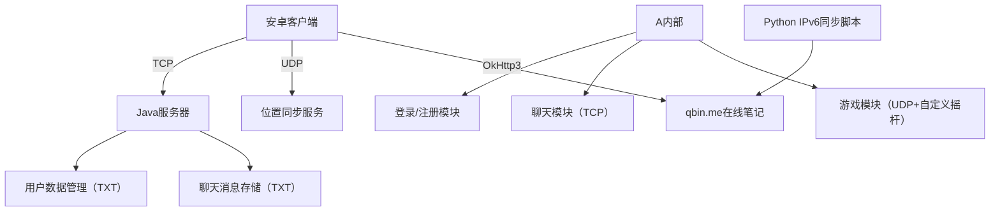

# 安卓多人聊天+联机游戏全栈开发实战：从Socket通信到自研游戏引擎的踩坑之路
> 这是我首次尝试“前后端+网络+游戏”一体化开发的项目——用Java写服务器、安卓原生做客户端，既要实现多人实时聊天，还要开发联机小游戏。过程中踩遍了Socket通信、多线程同步、游戏逻辑自研的坑，也让我彻底明白：“从零造轮子”虽能练手，但在复杂场景下选择合适的库有多重要。


## 🌟 项目核心定位：不止于聊天的多人互动应用
最初的想法很简单：做一个能让朋友联机聊天+玩小游戏的工具。最终实现的核心功能分为两大块：
- **多人实时聊天**：支持账号注册/登录、文字消息群发、聊天记录本地持久化，最多可同时在线5+用户，消息传输稳定；
- **联机小游戏（未完成）**：支持角色移动（自定义摇杆）、子弹攻击、多玩家位置同步，但因自研传输逻辑复杂，暂未实现碰撞检测、血量系统等关键功能。

从技术选型到功能落地，整个项目耗时2周，前后端代码累计近5000行，完全基于原生技术栈开发，没有依赖任何第三方框架（这也是后来游戏功能卡壳的重要原因）。

### 补充：IPv6地址自动同步工具（核心辅助脚本）
项目中安卓客户端需要通过IPv6连接服务器，而服务器IPv6地址可能动态变化，因此配套开发了Python脚本，实现IPv6地址的自动检测与同步，确保客户端能实时获取有效服务器地址。

#### 脚本核心功能
1. **自动检测公网IPv6**：通过国内可靠的公益API（`api64.ipify.org`、`v6.ident.me`）获取服务器公网IPv6地址，绕开本地网卡权限限制；
2. **实时同步到在线笔记**：将最新IPv6地址更新到qbin.me在线笔记，供安卓客户端通过OkHttp3爬取，避免手动修改客户端配置；
3. **稳定性保障**：支持多接口备选（避免单API故障）、超时重试、无效IPv6过滤（排除本地地址如`::1`），确保服务持续可用；
4. **后台持续运行**：按1秒间隔循环检测，IPv6地址变化时自动触发更新，无需人工干预。


#### 脚本与项目的关联
安卓客户端的`get_ipv6`类（`com.example.chatapp.clientservice.get_ipv6`）会通过OkHttp3请求qbin.me的笔记地址，获取脚本同步的最新IPv6，从而自动连接服务器，无需手动修改客户端代码中的服务器地址，解决了IPv6动态变化导致的连接失败问题。


## 🛠️ 技术栈拆解：前后端+网络全原生实现
### 1. 整体技术架构


### 2. 核心技术栈明细
<table style="width: 100%; border-collapse: collapse; border: 1px solid #e0e0e0; font-family: -apple-system, BlinkMacSystemFont, 'Segoe UI', sans-serif;">
  <thead>
    <tr style="background-color: #f5f5f5;">
      <th style="padding: 12px; text-align: left; border-bottom: 2px solid #ddd; font-weight: 600; width: 15%;">模块</th>
      <th style="padding: 12px; text-align: left; border-bottom: 2px solid #ddd; font-weight: 600; width: 25%;">技术选型</th>
      <th style="padding: 12px; text-align: left; border-bottom: 2px solid #ddd; font-weight: 600; width: 15%;">版本要求</th>
      <th style="padding: 12px; text-align: left; border-bottom: 2px solid #ddd; font-weight: 600; width: 45%;">核心作用</th>
    </tr>
  </thead>
  <tbody>
    <tr>
      <td style="padding: 12px; border-bottom: 1px solid #eee; vertical-align: middle; font-weight: 500;">安卓客户端</td>
      <td style="padding: 12px; border-bottom: 1px solid #eee; vertical-align: middle;">Java + Android XML</td>
      <td style="padding: 12px; border-bottom: 1px solid #eee; vertical-align: middle;">Android 9.0+</td>
      <td style="padding: 12px; border-bottom: 1px solid #eee; vertical-align: middle;">实现UI交互（登录/聊天/游戏）、Socket通信、自定义摇杆组件</td>
    </tr>
    <tr style="background-color: #fafafa;">
      <td style="padding: 12px; border-bottom: 1px solid #eee; vertical-align: middle; font-weight: 500;">服务器端</td>
      <td style="padding: 12px; border-bottom: 1px solid #eee; vertical-align: middle;">Java</td>
      <td style="padding: 12px; border-bottom: 1px solid #eee; vertical-align: middle;">JDK 1.8+</td>
      <td style="padding: 12px; border-bottom: 1px solid #eee; vertical-align: middle;">处理TCP/UDP连接、用户认证、消息转发、位置同步</td>
    </tr>
    <tr>
      <td style="padding: 12px; border-bottom: 1px solid #eee; vertical-align: middle; font-weight: 500;">网络通信</td>
      <td style="padding: 12px; border-bottom: 1px solid #eee; vertical-align: middle;">Socket（TCP）+ DatagramSocket（UDP）</td>
      <td style="padding: 12px; border-bottom: 1px solid #eee; vertical-align: middle;">无特殊要求</td>
      <td style="padding: 12px; border-bottom: 1px solid #eee; vertical-align: middle;">TCP传聊天/登录数据（可靠），UDP传游戏位置（低延迟）</td>
    </tr>
    <tr style="background-color: #fafafa;">
      <td style="padding: 12px; border-bottom: 1px solid #eee; vertical-align: middle; font-weight: 500;">数据存储</td>
      <td style="padding: 12px; border-bottom: 1px solid #eee; vertical-align: middle;">文本文件（TXT）</td>
      <td style="padding: 12px; border-bottom: 1px solid #eee; vertical-align: middle;">无特殊要求</td>
      <td style="padding: 12px; border-bottom: 1px solid #eee; vertical-align: middle;"><code>userstatics.txt</code>存账号密码，<code>chat.txt</code>存聊天记录</td>
    </tr>
    <tr>
      <td style="padding: 12px; border-bottom: 1px solid #eee; vertical-align: middle; font-weight: 500;">线程管理</td>
      <td style="padding: 12px; border-bottom: 1px solid #eee; vertical-align: middle;">原生Thread + Handler</td>
      <td style="padding: 12px; border-bottom: 1px solid #eee; vertical-align: middle;">无特殊要求</td>
      <td style="padding: 12px; border-bottom: 1px solid #eee; vertical-align: middle;">避免UI阻塞，同步网络数据与界面更新</td>
    </tr>
    <tr style="background-color: #fafafa;">
      <td style="padding: 12px; vertical-align: middle; font-weight: 500;">自定义组件</td>
      <td style="padding: 12px; vertical-align: middle;">JoystickView（摇杆）</td>
      <td style="padding: 12px; vertical-align: middle;">无特殊要求</td>
      <td style="padding: 12px; vertical-align: middle;">游戏场景的移动/攻击控制，支持死区过滤、方向归一化</td>
    </tr>
    <tr>
      <td style="padding: 12px; vertical-align: middle; font-weight: 500;">IPv6同步工具</td>
      <td style="padding: 12px; vertical-align: middle;">Python + requests</td>
      <td style="padding: 12px; vertical-align: middle;">Python 3.6+</td>
      <td style="padding: 12px; vertical-align: middle;">自动检测服务器IPv6地址，同步到在线笔记，供客户端获取</td>
    </tr>
  </tbody>
</table>

**关键决策**：选择全原生技术栈是为了“吃透底层逻辑”——比如手动实现TCP粘包处理、UDP丢包补偿、多线程同步，而非依赖Netty、Unity等成熟框架。但这个决策也为后续游戏功能开发埋下了隐患。


## 🎯 核心功能实现：聊天稳定，游戏踩坑
### 1. 多人实时聊天：功能完整，体验流畅
聊天模块是整个项目中最稳定的部分，核心逻辑基于TCP协议实现，从发送到接收形成完整闭环：

#### （1）消息传输流程
1. 客户端发送：用户输入消息 → 拼接格式（`用户名+发送:+内容`）→ `SendThread`通过TCP发送到服务器；
2. 服务器处理：`ReceThread`接收消息 → 写入`chat.txt`持久化 → 广播给所有在线客户端；
3. 客户端接收：`ReceThread`监听消息 → 存入`ConcurrentLinkedQueue`队列 → Handler更新UI，消息自动上移（支持50条历史记录）。

#### （2）核心代码片段（服务器广播逻辑）
```java
// 服务器端ReceThread处理聊天消息
if (content != null && !content.contains("login") && !content.contains("register")) {
    // 1. 写入聊天记录文件
    new chat_totxt(content).transference();
    // 2. 广播给所有在线客户端（遍历所有SendThread）
    for (connect client : clientList) {
        if (client.isOnline()) {
            client.st.line = new checkline().check() - 1;
            client.st.message = content; // 赋值给SendThread的message变量
        }
    }
}
```

#### （3）实现亮点
- **消息不丢失**：TCP协议保证可靠传输，服务器端持久化存储，客户端重启后可读取历史记录；
- **低卡顿**：用`Handler`在主线程更新UI，避免子线程直接操作视图导致的崩溃；
- **用户体验**：输入框为空时禁止发送，消息超过50条自动上移，支持“金币”显示（从用户数据中读取）。


### 2. 联机游戏：功能半成品，自研传输踩大坑
游戏模块是项目的“痛点”——我原本想实现“多玩家联机对战”，但因自研游戏数据传输逻辑，最终只完成了基础的角色移动和位置同步，核心战斗功能未落地。

#### （1）已实现的基础功能
1. **自定义摇杆控制**：通过`JoystickView`监听触摸事件，计算角色移动方向（归一化到-1~1），支持死区过滤（避免误触）；
2. **角色位置同步**：客户端通过UDP每秒10次发送位置数据（`POSITION_OF_PLAYER 用户名 x y`），服务器广播给其他客户端；
3. **子弹攻击**：点击攻击摇杆生成红色子弹视图，子线程控制子弹移动轨迹（超出范围后隐藏）。

#### （2）核心代码片段（角色位置同步）
```java
// 客户端发送位置（UDP）
new Thread(() -> {
    while(!isActivityDestroyed) {
        CharacterController.Position pos = characterController.getPosition();
        float x = pos.x/metrics.density;
        float y = pos.y/metrics.density;
        // 拼接位置消息格式
        SendThread_udp.msg= "POSITION_OF_PLAYER"+" "+Client.username+" "+x+" "+y;
        try {
            Thread.sleep(10); // 控制发送频率，避免网络拥堵
        } catch (InterruptedException e) {
            e.printStackTrace();
        }
    }
}).start();
```

#### （3）没搞定的坑：自研传输的困境
原本计划实现“子弹击中角色减血”“角色死亡判定”，但卡在了**数据同步一致性**和**碰撞检测效率**两个问题上，核心原因是“没有用现成的游戏开发库，全靠原生代码硬写”：

<table style="width: 100%; border-collapse: collapse; border: 1px solid #e0e0e0; font-family: -apple-system, BlinkMacSystemFont, 'Segoe UI', sans-serif; margin: 10px 0;">
  <thead>
    <tr style="background-color: #f8f9fa;">
      <th style="padding: 14px; text-align: left; border-bottom: 2px solid #ddd; font-weight: 600; width: 25%;">问题描述</th>
      <th style="padding: 14px; text-align: left; border-bottom: 2px solid #ddd; font-weight: 600; width: 35%;">底层原因</th>
      <th style="padding: 14px; text-align: left; border-bottom: 2px solid #ddd; font-weight: 600; width: 40%;">为什么用库能解决？</th>
    </tr>
  </thead>
  <tbody>
    <tr>
      <td style="padding: 12px; border-bottom: 1px solid #eee; vertical-align: top; font-weight: 500;">角色位置同步延迟/丢包</td>
      <td style="padding: 12px; border-bottom: 1px solid #eee; vertical-align: top;">UDP协议本身不保证可靠传输，自研的重传逻辑（简单重试）效果差</td>
      <td style="padding: 12px; border-bottom: 1px solid #eee; vertical-align: top;">游戏引擎（如Unity的UNet）或网络库（如ENet）有成熟的“可靠UDP”实现，自动处理丢包重传</td>
    </tr>
    <tr style="background-color: #fafafa;">
      <td style="padding: 12px; border-bottom: 1px solid #eee; vertical-align: top; font-weight: 500;">碰撞检测效率低</td>
      <td style="padding: 12px; border-bottom: 1px solid #eee; vertical-align: top;">原生Java计算两个视图的坐标重叠（<code>inzone()</code>函数），多玩家时循环次数太多</td>
      <td style="padding: 12px; border-bottom: 1px solid #eee; vertical-align: top;">游戏库（如LibGDX）有硬件加速的碰撞检测算法，支持矩形/圆形碰撞，效率提升10倍以上</td>
    </tr>
    <tr>
      <td style="padding: 12px; vertical-align: top; font-weight: 500;">多玩家同步时角色“瞬移”</td>
      <td style="padding: 12px; vertical-align: top;">客户端位置更新频率（10ms/次）与UI渲染频率（16ms/帧）不匹配，导致画面跳变</td>
      <td style="padding: 12px; vertical-align: top;">游戏库支持“插值平滑”，自动计算两次位置之间的过渡帧，避免瞬移感</td>
    </tr>
  </tbody>
</table>

简单说：游戏开发的核心是“实时性”和“流畅度”，而这两点需要底层网络优化、图形渲染加速的支撑。我用原生代码从零实现，相当于“用手搓轮子跑高速”，效率和稳定性都跟不上。


## 🚩 开发复盘：收获与反思
### 1. 值得肯定的亮点
- **全栈闭环能力**：从服务器搭建到客户端UI，从TCP聊天到UDP游戏同步，再到Python辅助脚本开发，独立完成所有模块，打通了“前后端+网络+辅助工具”的全链路；
- **细节处理到位**：聊天模块的消息持久化、登录超时处理、摇杆的死区过滤，以及IPv6同步脚本的多接口备选、超时重试，这些细节提升了项目稳定性；
- **问题解决思路**：遇到TCP粘包问题时，用`newLine()`作为消息分隔符；遇到IPv6动态变化问题，开发Python脚本自动同步；遇到UI卡顿，用`ConcurrentLinkedQueue`做消息缓存，解决方案都很接地气。

### 2. 最深刻的教训：不要盲目“造轮子”
游戏功能卡壳的核心教训是：**在复杂场景下，选择合适的工具比“从零实现”更重要**。

- 如果你想做联机游戏，优先用成熟的游戏引擎（Unity/Unreal）或网络库（ENet、Photon），它们已经解决了90%的底层问题（如网络同步、碰撞检测）；
- 我当初为了“练手”选择原生开发，虽然理解了底层逻辑，但也浪费了大量时间在“重复造轮子”上，最终导致游戏功能未完成。

### 3. 未来优化方向
1. **游戏功能补全**：引入LibGDX游戏库，实现碰撞检测、血量系统、关卡设计，替换自研的位置同步逻辑；
2. **数据存储升级**：把TXT文件替换为MySQL数据库，支持用户数据加密、聊天记录分页查询；
3. **网络优化**：用Netty替换原生Socket，支持高并发连接，解决多用户同时在线时的卡顿问题；
4. **UI美化**：加入过渡动画、角色皮肤、子弹特效，提升游戏视觉体验；
5. **脚本优化**：给Python脚本增加日志存储功能，支持异常邮件告警，提升运维便利性。


## 📌 项目总结
这个项目让我彻底明白：“技术选型”是开发前最重要的决策。聊天功能之所以稳定，是因为TCP+文本存储的场景适合原生实现；IPv6同步脚本之所以高效，是因为选对了`requests`库和公益API；而游戏功能之所以卡壳，是因为我用“原生开发”去挑战“游戏引擎的领域”。

如果你也是刚接触全栈开发的新手，建议从“单一功能”入手（比如先做好聊天），再逐步扩展复杂场景。遇到不熟悉的领域时，多查成熟的解决方案，不要盲目“从零造轮子”——毕竟，能用工具解决的问题，就不要用手去扛。
